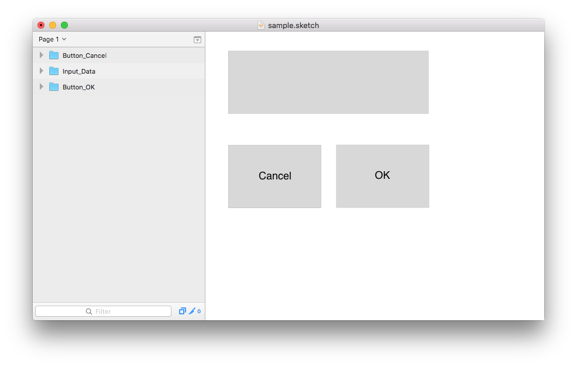
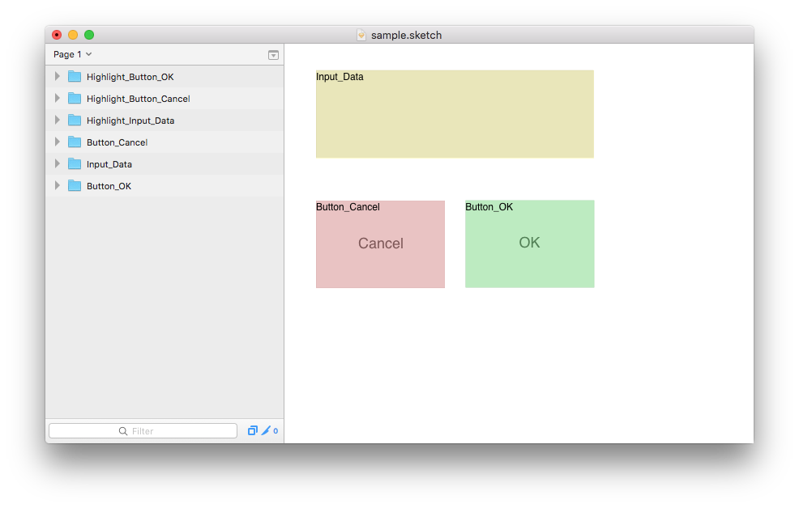

== LabelSelection

This is a plugin for https://www.sketchapp.com/[Sketch]. It adds a semi-transparent box with a label on top of the current selection. The label is using the name of the first element of the selection.

This allows for adding explanations to UI designs, e.g. so that implementors know which groups or components are to be used to create a certain page or dialog.

== Installation

. Clone this repository
. Double-Click "LabelSelection.sketchplugin"

== Usage

* Select whatever you want to mark with a highlight
* Press cmd-alt-shift 6, 7, 8, or 9 for yellow, red, green, or blue highlight respectively; alternatively use menu items "Plugins / LabelSelection / Label Selection Yellow" etc.

== Example

Disclaimer: The result may be a bit different depending on latest changes to the plugin.

Before:

After:

== Revision History

* 0.1: initial version
* 0.2: all added rectangles and texts are added to a single group within the current artgroup (or on top level)

== License

Eclipse Public License, 1.0
